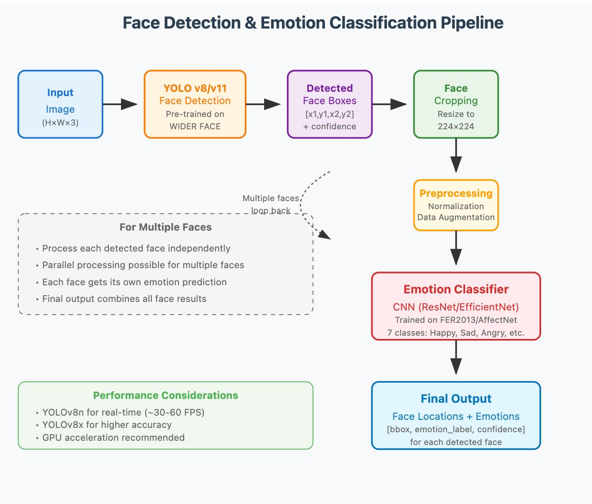
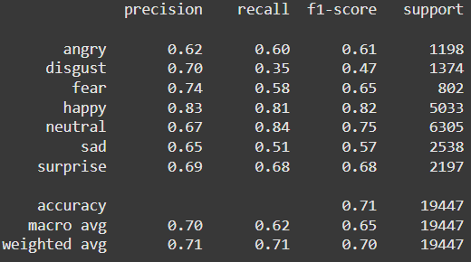
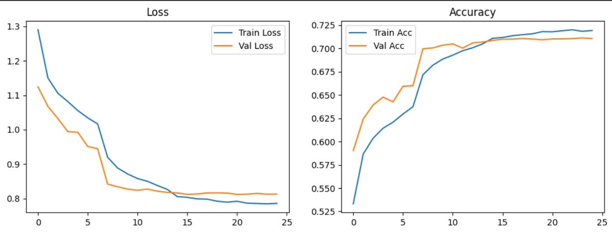

# Face Detection & Emotion Classification

A desktop application that combines YOLOv12 face detection with EfficientNet-B4 emotion classification.

## Features

- **Face Detection**: Uses YOLOv12-Face model for accurate face detection
- **Emotion Classification**: EfficientNet-B4 CNN classifies emotions into 7 categories
- **Multiple Models**: Switch between different YOLO and emotion classification models
- **Interactive GUI**: Tkinter-based interface with drag-and-drop support
- **Real-time Processing**: Adjustable confidence threshold for detection sensitivity

## Model Architecture


## Installation

```bash
pip install -r requirements.txt
```

## Usage

```bash
python main.py
```

## Results and Analysis




## References/Datasets
Abbas, S. (2024). Expression in the Wild (EXP-W) Dataset. Kaggle. Retrieved from https://www.kaggle.com/datasets/shahzadabbas/expression-in-the-wild-expw-dataset
Shazida, M. J. (2024). AffectNet. Kaggle. Retrieved from https://www.kaggle.com/datasets/mstjebashazida/affectnet
See [USAGE.md](USAGE.md) for detailed instructions.
