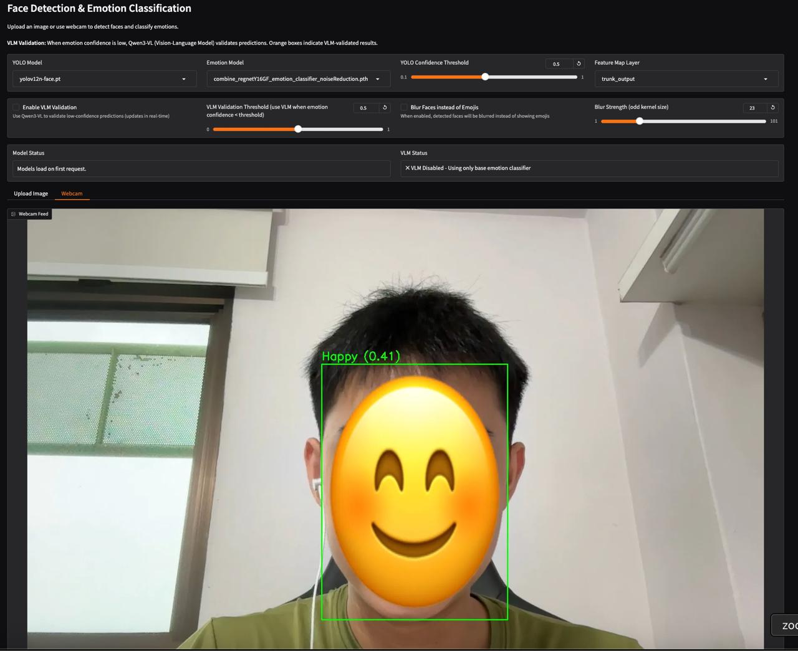
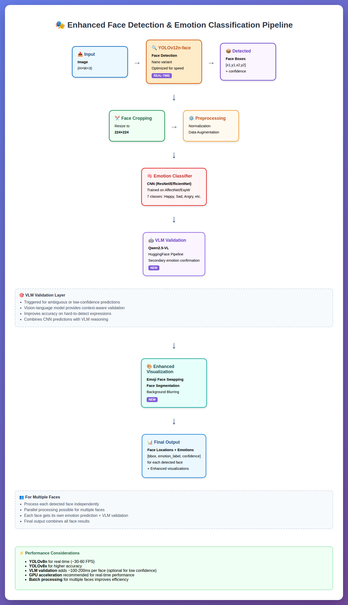
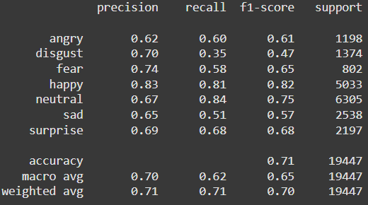
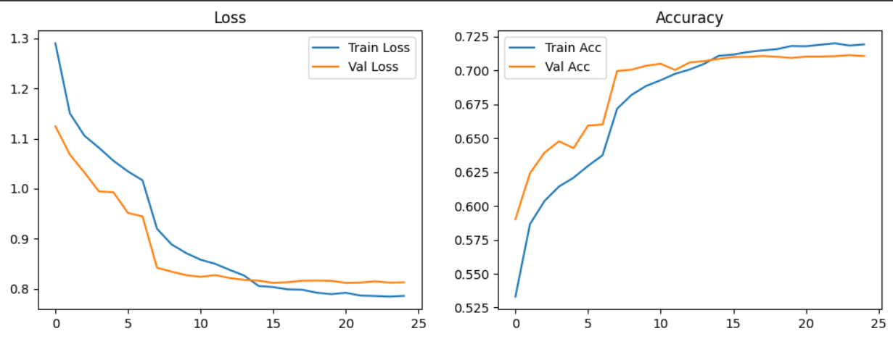
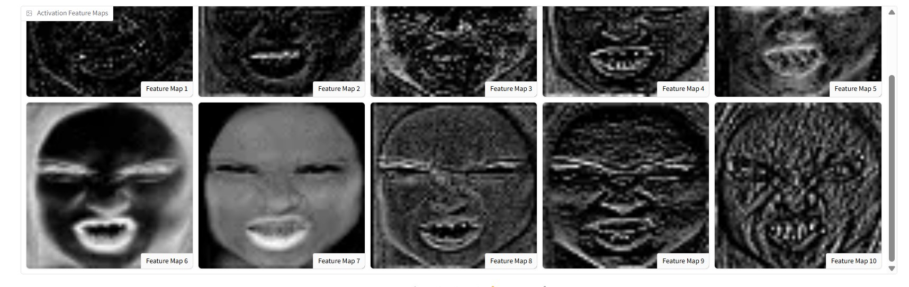

# Face Detection & Emotion Classification

**Objectives**
This project aims to develop an end-to-end real time facial emotion recognition system for both images and live video. It uses YOLO to detect faces, a CNN to classify seven core emotions, and emoji-based face swapping to enhance visualization. To protect privacy, the system applies face-segmentation blurring to anonymize identities. Combined, these components create a robust, real-time pipeline for emotion analysis, interactive visualization, and privacy-preserving processing




## 📂 Model Architecture




## 🚀 Gradio Web Application (`app.py`)

A web-based application offering advanced features for face detection and emotion classification, accessible via a browser.

Link: 
```angular2html
https://aai3001pr12demo2-131604205847.asia-southeast1.run.app
```

### Features

- **Face Detection**: Utilizes various YOLO models (e.g., `yolov12n-face.pt`, `yolov8n.pt`, `yolov8s.pt`, `yolov8m.pt`, `yolo11n-seg.pt`) for accurate face detection, including segmentation capabilities.
- **Emotion Classification**: Employs multiple emotion classification models (e.g., `resnet18_emotion_classifier.pth`, `combine_regnetY16GF_emotion_classifier.pth`) to classify emotions into 7 categories (Angry, Disgust, Fear, Happy, Sad, Surprise, Neutral).
- **Vision-Language Model (VLM) Validation**: Integrates `Qwen3-VL-2B-Instruct` to validate low-confidence emotion predictions, improving accuracy. Utillizes HuggingFace Transformer pipeline for inference
- **Interactive Interface**: Gradio-based UI with support for image uploads and real-time webcam processing.
- **Customizable Processing**: Adjustable confidence threshold for detection, option to blur faces or overlay emojis, and visualization of activation feature maps.
- **Model Selection**: Easily switch between different YOLO and emotion classification models.

## Usage

### ⚙️ Installation

1.  Clone the repository:
    ```bash
    git clone https://github.com/mattcxj02/Emotion_Detection_Classifier
    cd Emotion_Detection_Classifier
    ```
2.  Install the required dependencies:
    ```bash
    pip install -r requirements.txt
    ```
3.  Download the necessary models into the `models/` directory. The application expects specific `.pt` and `.pth` files.


To run the Gradio web application:

```bash
python app.py
```

The application will typically be available at `http://localhost:8080` or a similar address.


## Results and Analysis




### Activation Layers of CNN Model



## References/Datasets
Abbas, S. (2024). Expression in the Wild (EXP-W) Dataset. Kaggle. 
Retrieved from https://www.kaggle.com/datasets/shahzadabbas/expression-in-the-wild-expw-dataset Shazida, M. J. (2024). 

AffectNet. Kaggle. 
Retrieved from https://www.kaggle.com/datasets/mstjebashazida/affectnet


### 🖥️ Tkinter Desktop Application (`main.py`) [depreciated]

A desktop application providing basic face detection and emotion classification functionalities.

#### Features

- **Live Face Detection**: Uses various YOLO models (e.g., `yolov12n-face.pt`, `yolov8n.pt`, `yolov8s.pt`, `yolov8m.pt`) for face detection.
- **Live Emotion Classification**: Employs emotion classification models (e.g., `resnet18_emotion_classifier.pth`, `efficientnet_b4_Tuned2_best.pth`) to classify emotions.
- **Interactive GUI**: Tkinter-based interface with drag-and-drop support for images.
- **Adjustable Confidence**: Set a confidence threshold for face detection.


#### Usage

To run the Tkinter desktop application:

```bash
python main.py
```


